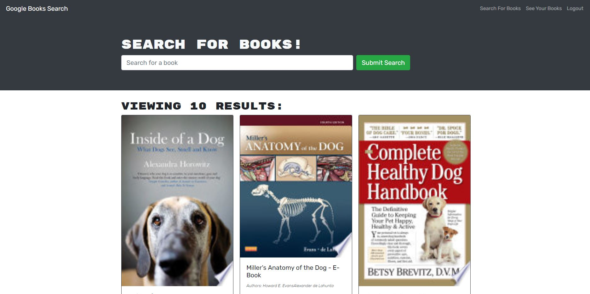

# Google Book Search

## Purpose
To create an application that provides a Search and Save for various books using Google utilizing an Appolo server and GraphQL in lieu of RESTful APIs.

## Features
When the user loads the server, they are presented with a search bar where they can enter in a book title or author name. When the user signs up or logs in to their profile, they are able to save books that they have searched, as well as view books that they have previously saved. They can also remove any books that are no longer needed!

## Built With
* React JS
* JavaScript
* Apollo
* GraphQL
* Heroku
* Node JS 
* NoSQL - MongoDB
* Express
* Mongoose
* Concurrently

## Usage
To run program: node server

## Deployed Application
https://pure-wave-30954.herokuapp.com/

## Project Status
This Google Book Search is complete in adherence with acceptance criteria

## Contribution
Created by Jennifer Mulder
